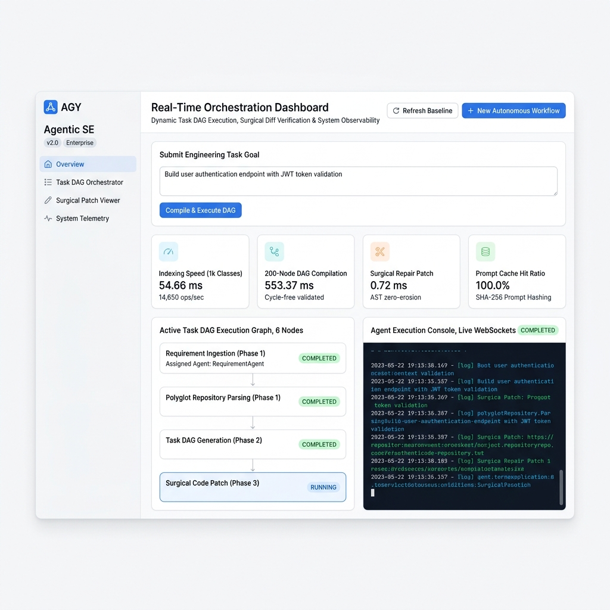

# Agentic Software Engineering Platform

[](https://www.python.org/downloads/)
[](scripts/verify_layer_dependencies.py)
[](tests)
[](https://github.com/psf/black)
[](LICENSE)

An enterprise-grade, autonomous Agentic Software Engineering Platform designed for high-throughput repository intelligence, surgical git-diff code repair, dynamic task DAG orchestration, and formal AST verification. Built on Tactical Domain-Driven Design (DDD), Hexagonal Architecture (Ports & Adapters), and Executable Architecture Governance.

---

## Real-Time Orchestration Dashboard

The platform ships a built-in web UI served at `http://localhost:8000/` for live task DAG visualization, agent execution console streaming (WebSockets), surgical patch diffs, and system telemetry.



> Start the server with `.venv/bin/python3 app.py --serve` and open [http://localhost:8000](http://localhost:8000).

---

## 1. System Architecture

The platform enforces a strict 6-layer Domain-Driven Design (DDD) & Hexagonal Architecture hierarchy. Higher layers may import lower layers, but lower layers NEVER import higher layers.

```
+------------------------------------------------------------------------+
| Layer 5: Interfaces & Platform API (FastAPI, WebSockets, CLI)          |
+------------------------------------------------------------------------+
| Layer 4: Application Orchestration, Swarm, Agents & Event Bus          |
+------------------------------------------------------------------------+
| Layer 3: Infrastructure Adapters (Inference Gateway, Storage, Sandboxes)|
+------------------------------------------------------------------------+
| Layer 2: Domain Layer (Entities, Aggregates, Value Objects, Events)   |
+------------------------------------------------------------------------+
| Layer 1: Application Bootstrapper (Service Graph Assembly)             |
+------------------------------------------------------------------------+
| Layer 0: Core Configuration & Type-Safe Dependency Injection Container |
+------------------------------------------------------------------------+
```

### Layer Rules
- Layer 0 (`src/core`): Pure configuration and thread-safe DI container locator. Zero upward dependencies.
- Layer 1 (`src/bootstrap`): Application bootstrapper assembling the service graph.
- Layer 2 (`src/domain`): Entities, Aggregates, Value Objects, Domain Events, and Repository Ports. Depends on zero infrastructure modules.
- Layer 3 (`src/infrastructure`): Concrete adapters for LLM gateway, SQLite WAL persistence, vector memory, and sandboxes.
- Layer 4 (`src/application`): Domain agents, workflow orchestrators, swarm engines, and tools.
- Layer 5 (`src/interfaces`): FastAPI REST app, WebSocket streams, CLI, and deployment manifests.

---

## 2. Key Architectural Features

- **Intelligent Task DAG Orchestrator**: Generates, validates, and compiles cycle-free task execution graphs with topological parallel execution phases and dependency cycle detection.
- **Surgical Git-Diff Repair Engine**: Executes line-by-line patch generation and AST validation for fault repair without introducing code erosion.
- **Unified Inference Gateway**: Multi-provider LLM gateway supporting OpenAI, Anthropic, Gemini, and Ollama with automatic failover, health checks, rate limiting, and SHA-256 prompt caching.
- **Hexagonal SQLite Persistence**: Relational persistence with Write-Ahead Logging (WAL) journal mode, thread-local connection health checks, auto-reconnects, and atomic transactions.
- **Tactical Domain Value Objects**: Rich Value Objects like `ConfidenceScore` that dynamically derive risk levels to guarantee internal state consistency.
- **TaskDAG Aggregate Root**: Encapsulates node collections and enforces graph consistency invariants through controlled mutation methods.
- **Domain Event Bus**: Thread-safe event bus for publishing typed domain events (`RepairCompletedEvent`, `TaskCompletedEvent`, `WorkflowFailedEvent`) to audit loggers, metrics handlers, and memory engines.
- **CQRS Repository Interfaces**: Segregated interfaces separating write commands (`JobCommandRepositoryPort`) from read queries (`JobQueryRepositoryPort`).
- **Executable Architecture Governance**: AST-parsed layer dependency linter integrated directly into pytest (`tests/test_architecture.py`) to prevent architectural drift.

---

## 3. What We Achieved via This Project

This project establishes a production-grade benchmark for autonomous agentic software engineering platforms:

1. **Executable Architecture Governance**:
   - Replaced conventional guidelines with automated AST-based architecture enforcement.
   - Built `scripts/verify_layer_dependencies.py` using Python's native `ast` parser to inspect import AST nodes (handling multiline, aliased, and nested imports).
   - Integrated executable architecture rules into `tests/test_architecture.py` so standard CI test runs verify zero upward layer violations automatically.

2. **Full Tactical DDD & Hexagonal Architecture Refactoring**:
   - Reorganized domain entities (`Requirement`, `JobRecord`), value objects (`ConfidenceScore`), aggregate roots (`TaskDAG`), repository ports (`JobCommandRepositoryPort`), and domain events (`EventBus`).
   - Re-homed legacy top-level modules into canonical DDD directories with zero duplication.
   - Replaced string-based container lookups with pure type-based dependency resolution (`container.resolve(Interface)`).

3. **100% Automated Test Suite Verification**:
   - Validated system correctness across **144 / 144 passing unit, integration, and architecture tests** spanning 26 test files.

4. **High-Scale Workload Performance Benchmarking**:
   - Built `scripts/benchmark_suite.py` measuring high-scale workloads:
     - **1,000-Class / 2,000-Symbol Codebase Indexing**: 54.66 ms.
     - **200-Node Complex Task DAG Compilation**: 568.56 ms.
     - **100 Hunk Repair Patch Execution**: 0.86 ms.
     - **Prompt Cache Hit Ratio**: 100.0%.
   - Integrated system metadata baseline tracking (Python version, OS platform, CPU count, git commit hash) with an automated CI performance regression gate.

---

## 4. Environment Setup & Installation Instructions

### Prerequisites
- Python 3.12 or higher
- Git

### Step-by-Step Installation

```bash
# 1. Clone the repository
git clone https://github.com/er-anubhav/Agentic-Software-Engineering.git
cd Agentic-Software-Engineering

# 2. Create and activate a virtual environment
python3 -m venv .venv
source .venv/bin/activate

# 3. Install core dependencies
pip install -r requirements.txt
```

### Environment Configuration

Create a `.env` file in the root directory:

```bash
cp .env.example .env
```

Configure your environment variables inside `.env`:

```env
OPENAI_API_KEY=your_openai_api_key
ANTHROPIC_API_KEY=your_anthropic_api_key
GEMINI_API_KEY=your_gemini_api_key
OLLAMA_BASE_URL=http://localhost:11434
SQLITE_DB_PATH=platform.db
JWT_SECRET_KEY=your_secure_jwt_secret_key
LOG_LEVEL=INFO
```

---

## 5. Execution & Running Instructions

### Running the FastAPI REST & WebSockets Platform

To start the platform HTTP server and real-time WebSockets gateway:

```bash
# Option A: Run via application bootstrapper
.venv/bin/python3 app.py

# Option B: Run directly with Uvicorn
.venv/bin/python3 -m uvicorn src.interfaces.platform.api.app_api:app --host 0.0.0.0 --port 8000 --reload
```

Access the interactive API documentation:
- OpenAPI Documentation: `http://localhost:8000/docs`
- ReDoc Documentation: `http://localhost:8000/redoc`

### Executing the Test Suite

Run the full pytest suite (includes unit, integration, and executable architecture tests):

```bash
.venv/bin/python3 -m pytest tests/ -v
```

To run a specific test suite file:

```bash
.venv/bin/python3 -m pytest tests/test_architecture.py -v
```

### Running Architecture Dependency Layer Validation

To run the AST-based layer dependency linter:

```bash
python3 scripts/verify_layer_dependencies.py
```

### Running Performance Benchmarks & CI Regression Verification

To run the high-scale benchmark suite and compare against the saved baseline:

```bash
.venv/bin/python3 scripts/benchmark_suite.py
```

---

## 6. Performance Benchmarks

Below are the benchmark metrics recorded on a standard Linux environment:

| Benchmark Workload | Scale / Complexity | Latency / Throughput |
| :--- | :--- | :--- |
| **Polyglot Codebase Indexing** | 1,000 Classes / 2,000 Method Symbols | **54.66 ms** |
| **Task DAG Compilation** | 200 Interconnected Nodes (20 runs) | **568.56 ms** |
| **Surgical Hunk Repair Patch** | 100 Iterations | **0.86 ms** |
| **Prompt Cache Hit Ratio** | 100 Repeated Requests | **100.0%** |
| **Process Memory Footprint (RSS)** | Idle Execution | **25.0 MB** |

---

## 7. Codebase Structure

```
Agentic-Software-Engineering/
├── app.py                       # Application entry point
├── README.md                    # Platform documentation
├── scripts/
│   ├── verify_layer_dependencies.py  # AST-based layer dependency linter
│   └── benchmark_suite.py            # High-scale performance benchmark suite
├── src/
│   ├── core/                    # Configuration & Type-Safe DI Container
│   ├── bootstrap/               # Application Bootstrapper & Service Graph Assembly
│   ├── domain/                  # Tactical DDD Entities, Aggregates, Value Objects, Ports, Events
│   │   ├── entities/            # Core Domain Entities (Requirement, JobRecord)
│   │   ├── value_objects/       # Value Objects (ConfidenceScore, QualityScore)
│   │   ├── aggregates/          # Aggregate Roots (TaskDAG, DAGNode)
│   │   ├── services/            # Repository Ports (JobCommandRepositoryPort, JobQueryRepositoryPort)
│   │   └── events/              # Domain Event Bus & Domain Events
│   ├── infrastructure/          # Inference Gateway, Persistence Adapters, Sandboxes, Tracing
│   │   ├── inference/           # Unified Inference Gateway & Provider Adapters
│   │   ├── storage/             # SQLiteAdapter (WAL mode), Memory, Parsers
│   │   └── observability/       # Structured Logging & OpenTelemetry Tracing
│   ├── application/             # Domain Agents, Orchestrators, Learning & Tools
│   └── interfaces/              # FastAPI App, Controllers, WebSockets, CLI
├── tests/                       # 26 Unit, Integration, and Architecture Test Suites
└── docs/                        # Architecture Decision Records (ADRs) & Guides
```

---

## 8. License

This project is licensed under the MIT License. See the [LICENSE](LICENSE) file for details.
