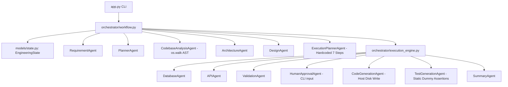
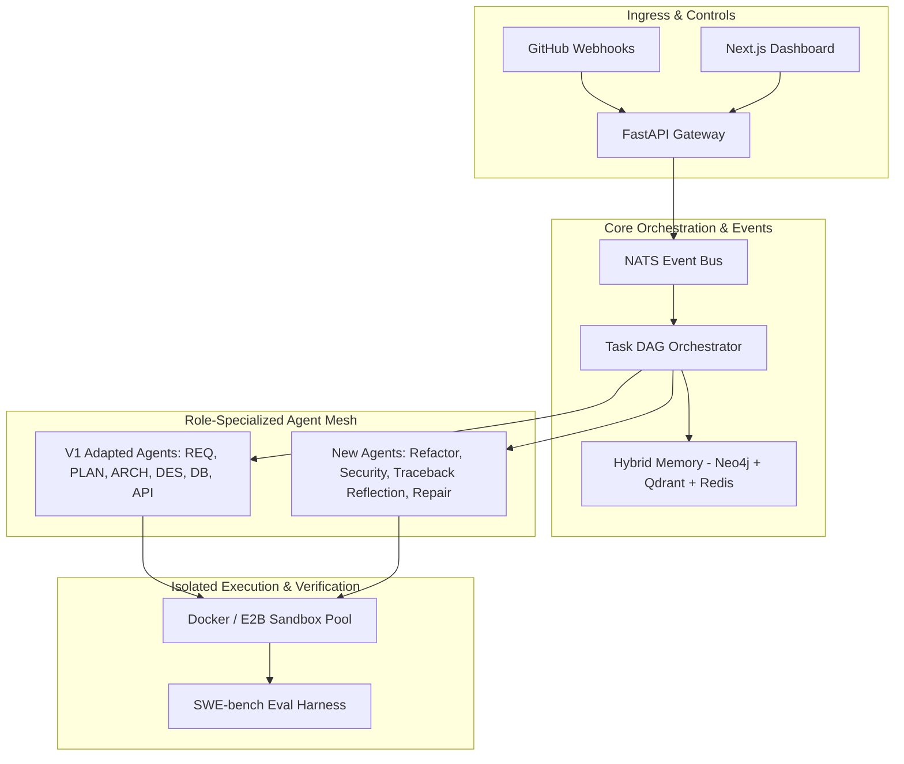

# CTO Architectural Strategy: Evolutionary Migration Plan (AS-IS → TO-BE)

**Role**: Chief Technology Officer & Principal Systems Architect  
**Mandate**: Evolve the existing V1 codebase into a research-grade, production-ready Agentic Software Engineering Platform using **Incremental Migration (Strangler Fig Pattern)**.  
**Core Constraint**: Do NOT throw away working code. Preserve existing functional components while refactoring, replacing weak modules, and adding missing enterprise capabilities.  

---

## 1. Repository Inventory & Component Classification

Based on deep code inspection of the existing workspace, every existing module and file has been classified into one of three migration categories: **KEEP (Reusable)**, **REFACTOR (Enhance)**, or **REPLACE (Deprecate & Re-architect)**.

```
+---------------------------------------------------------------------------------------------------+
|                                      V1 COMPONENT CLASSIFICATION                                  |
+------------------------------------+--------------------------------+-----------------------------+
| KEEP (Reusable As-Is / Minimal)    | REFACTOR (Improve & Modularize)| REPLACE (Deprecate & Swap)  |
+------------------------------------+--------------------------------+-----------------------------+
| - models/state.py (State Schema)   | - agents/base_agent.py         | - agents/execution_planner  |
| - config/llm.py (Ollama Client)    | - agents/codebase_analysis.py  | - agents/test_generation.py |
| - tools/json_parser.py (Helpers)   | - agents/validation_agent.py   | - orchestrator/execution    |
| - agents/requirement_agent.py      | - agents/code_generation.py    | - orchestrator/workflow.py  |
| - agents/planner_agent.py          | - agents/architecture_agent.py |                             |
| - agents/design_agent.py           | - agents/database_agent.py     |                             |
| - agents/api_agent.py              | - agents/human_approval.py     |                             |
| - agents/summary_agent.py          |                                |                             |
+------------------------------------+--------------------------------+-----------------------------+
```

### Detailed Component Analysis

#### 1. REUSABLE COMPONENTS (KEEP)
- [models/state.py](file:///home/anubhavtripathi/Documents/Projects/agentic-se/models/state.py): Clean, well-structured Pydantic/dataclass schema representing engineering context (`functional_requirements`, `architecture`, `design`, `generated_code`, `validation_report`).
- [config/llm.py](file:///home/anubhavtripathi/Documents/Projects/agentic-se/config/llm.py): Functional factory returning shared `ChatOllama` LLM instances.
- [agents/requirement_agent.py](file:///home/anubhavtripathi/Documents/Projects/agentic-se/agents/requirement_agent.py), [agents/planner_agent.py](file:///home/anubhavtripathi/Documents/Projects/agentic-se/agents/planner_agent.py), [agents/design_agent.py](file:///home/anubhavtripathi/Documents/Projects/agentic-se/agents/design_agent.py), [agents/api_agent.py](file:///home/anubhavtripathi/Documents/Projects/agentic-se/agents/api_agent.py): Solid domain prompt contracts that generate clean JSON specifications.

#### 2. COMPONENTS TO REFACTOR
- [agents/base_agent.py](file:///home/anubhavtripathi/Documents/Projects/agentic-se/agents/base_agent.py): Add Pydantic structured output validation (`with_structured_output`) and retry handlers. Ensure ALL agents inherit from `BaseAgent`.
- [agents/codebase_analysis_agent.py](file:///home/anubhavtripathi/Documents/Projects/agentic-se/agents/codebase_analysis_agent.py): Extend AST scanner to support polyglot Tree-sitter parsing and output SCIP-compatible symbol graphs.
- [agents/validation_agent.py](file:///home/anubhavtripathi/Documents/Projects/agentic-se/agents/validation_agent.py): Re-order execution schedule so validation runs AFTER code generation. Add AST linter checks.
- [agents/code_generation_agent.py](file:///home/anubhavtripathi/Documents/Projects/agentic-se/agents/code_generation_agent.py): Decouple direct host disk writes into containerized sandbox writing.

#### 3. COMPONENTS TO REPLACE ENTIRELY
- [agents/execution_planner_agent.py](file:///home/anubhavtripathi/Documents/Projects/agentic-se/agents/execution_planner_agent.py): Currently hardcodes a 7-step static list. Replace with a dynamic **Task DAG Compiler**.
- [agents/test_generation_agent.py](file:///home/anubhavtripathi/Documents/Projects/agentic-se/agents/test_generation_agent.py): Currently writes static mock string files (`assert True`). Replace with an LLM-driven **Pytest Generation & Verification Agent**.
- [orchestrator/workflow.py](file:///home/anubhavtripathi/Documents/Projects/agentic-se/orchestrator/workflow.py) & [orchestrator/execution_engine.py](file:///home/anubhavtripathi/Documents/Projects/agentic-se/orchestrator/execution_engine.py): Hardcodes Windows file path `C:\Projects\...` and linear step iteration. Replace with **Temporal / Custom Async DAG Orchestrator**.

#### 4. MISSING ENTERPRISE SUBSYSTEMS TO ADD
1. **Container Execution Sandbox Pool** (Docker / E2B microVMs)
2. **Code Knowledge Graph** (Neo4j / SCIP)
3. **Hybrid Memory System** (Qdrant Vector DB + Redis)
4. **NATS CloudEvents Event Bus Backbone**
5. **Empirical Traceback Reflection & Repair Engine**
6. **SWE-bench Evaluation Suite**
7. **FastAPI REST/WebSocket API Gateway**
8. **Next.js Real-time Visual Control Dashboard**

---

## 2. Current Architecture (AS-IS) vs. Target Architecture (TO-BE)

### 2.1 AS-IS Architecture (V1 Current State)



### 2.2 TO-BE Architecture (V2 Enterprise Target)



---

## 3. Comprehensive Gap Analysis Matrix

| Capability Dimension | Current AS-IS State (V1) | Target TO-BE State (V2) | Architecture Gap / Remediation Strategy |
| :--- | :--- | :--- | :--- |
| **Execution Flow** | Linear 7-step hardcoded pipeline. | Dynamic Task DAG with branching and parallel node execution. | Replace `ExecutionPlannerAgent` with dynamic DAG Compiler & Temporal workflow engine. |
| **Code Analysis** | Single-threaded `ast.walk` for Python files only. | Multi-language Tree-sitter + SCIP indexing in Neo4j code graph. | Wrap existing `CodebaseAnalysisAgent` with a Tree-sitter SCIP adapter plugin. |
| **Code Execution** | Directly writes files to local host disk (`generated_project/`). | Ephemeral network-isolated container pool (Docker / E2B microVMs). | Redirect file output from host filesystem to gRPC sandbox container client. |
| **Testing Capability** | Static text strings (`assert True`). | Dynamic Pytest test generation verified in container sandbox. | Replace `TestGenerationAgent` with LLM-driven test generator + sandbox runner. |
| **Validation Gate** | Runs before code generation (reports false missing files). | Runs inside sandbox after code generation and build. | Adjust DAG node ordering; validate actual compiled sandbox artifacts. |
| **Self-Healing** | Loops on validator agent without re-running code generation. | Empirical traceback diagnosis -> surgical diff patch generation -> sandbox re-test. | Implement `ReflectionEngine` and `RepairEngine` connected to sandbox error logs. |
| **Output Parsing** | Triple-backtick string replacement in `tools/json_parser.py`. | Native Pydantic `with_structured_output` JSON schema enforcement. | Refactor `BaseAgent.invoke_json` to leverage Pydantic structured completion. |
| **State Storage** | Single mutable in-memory dataclass instance. | Event-driven NATS CloudEvents + Redis working memory + Neo4j Graph. | Migrate `EngineeringState` into an event-sourced blackboard store. |

---

## 4. Incremental Migration Strategy (Strangler Fig Pattern)

To avoid breaking existing functionality, migration is divided into **4 Backward-Compatible Incremental Steps**:

```
[Phase A: Compatibility Adapter] ──> [Phase B: Sandbox & State Decoupling]
                                                │
                                                ▼
[Phase D: Enterprise UI & Webhooks] <── [Phase C: Dynamic DAG & Self-Healing]
```

### Phase A: Architecture Sanitization & Adapter Layer (Preserve Working Code)
1. **Fix Immediate V1 Bugs**:
   - Remove double LLM call bug in `RequirementAgent.py`.
   - Remove hardcoded Windows path `C:\Projects\...` in `workflow.py`.
   - Fix agent inheritance so all agents inherit from `BaseAgent`.
2. **Introduce Adapter Interfaces**:
   - Wrap `EngineeringState` in a thread-safe `StateRepository` interface.
   - Upgrade `BaseAgent.invoke_json` to use Pydantic schemas while maintaining fallback to `tools/json_parser.py`.

### Phase B: Sandbox Isolation & Real Test Generation
1. **Container Sandbox Pool**:
   - Implement `DockerSandboxProvider` implementing `SandboxInterface`.
   - Update `CodeGenerationAgent` to write files into the sandbox instead of local disk.
2. **Replace TestGenerationAgent**:
   - Deprecate static dummy test strings.
   - Implement LLM-driven `PytestGeneratorAgent` that reads `api_spec` and generates functional unit tests executed inside the Docker sandbox.

### Phase C: Task DAG Orchestrator & Reflection Engine
1. **Strangle ExecutionPlannerAgent**:
   - Replace hardcoded list with `TaskDAGCompiler`.
   - Implement `TemporalWorkflowEngine` to run DAG tasks asynchronously.
2. **Add Empirical Self-Healing Loop**:
   - Intercept sandbox test failures (`pytest` exit code != 0).
   - Feed stack tracebacks into `ReflectionAgent` -> `RepairAgent` -> apply `git diff` patch -> re-run sandbox tests.

### Phase D: Multi-Language Code Graph & Enterprise Control UI
1. **Upgrade Codebase Analysis**:
   - Enhance `CodebaseAnalysisAgent` with Tree-sitter parser to index non-Python files into Neo4j.
2. **Add FastAPI & Next.js Control Panel**:
   - Wrap `Workflow` in FastAPI REST/WebSocket endpoints.
   - Launch Next.js dashboard displaying live React Flow DAG node visualization.

---

## 5. Architectural Safeguards & Risk Mitigation

1. **Zero Downtime / Zero Breakage**: Every migration phase runs unit tests against existing functionality before switching the active execution engine.
2. **Backward Compatibility**: The CLI entrypoint `app.py` remains functional throughout all migration phases.
3. **Rollback Strategy**: If a new microservice (e.g. Neo4j graph) is unavailable, system gracefully falls back to V1 in-memory dataclass scanning.
