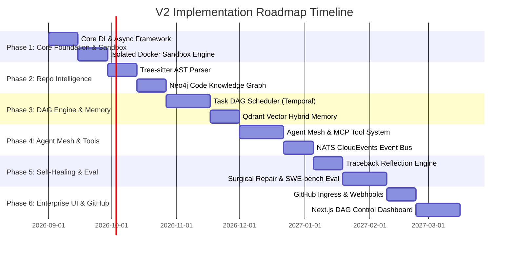

# Implementation Roadmap & Milestone Strategy: Version 2 Platform

**Document Status**: Production Implementation Strategy  
**Author**: Principal Software Architect & Technical Product Architect  
**Objective**: Phased, incremental build roadmap ensuring every phase is independently runnable, demonstrable, and technically zero-debt.  

---

## 1. Executive Roadmap Summary

To transform the V2 Architecture Blueprint into reality without taking shortcuts or accumulating technical debt, the platform is divided into **6 Sequential Phased Milestones**. 

Each phase builds directly upon the foundational capabilities of prior phases while delivering a fully functional, independently testable milestone artifact.

---

## 2. Detailed Implementation Phases

---

### Phase 1: Core Runtime Foundation & Ephemeral Sandbox Engine
- **Focus**: Establishing clean architecture boundaries, async containerized execution, and robust dependency injection.

#### Subsystems Built:
- **Subsystem 1**: Core Runtime (`pydantic-settings`, dependency container, health checks).
- **Subsystem 8**: Execution Sandbox (Docker / E2B container pool with gRPC runner).
- **Subsystem 18**: Observability Foundation (OpenTelemetry tracing & logging).

#### Technical Deliverables:
1. Pure async DI bootstrap pipeline.
2. Container pool manager capable of spawning isolated containers in <100ms.
3. gRPC daemon inside sandbox to execute shell commands, capture stdout/stderr, and extract stack tracebacks.

#### Independently Runnable & Demonstrable Goal:
- Run a CLI command that passes a code string (e.g. FastAPI app), provisions a clean sandbox container, executes `pytest`, streams logs in real-time, and returns a structured execution output.

#### Technical Debt Prevention:
- Zero local host file execution. All commands strictly executed inside ephemeral containers.
- 100% typed interfaces using Pydantic v2 schemas.

- **Dependencies**: None (Root Foundation).
- **Complexity Score**: **Medium (3/5)**

---

### Phase 2: Polyglot Repository Intelligence & Code Knowledge Graph
- **Focus**: Deep codebase understanding and structural dependency extraction.

#### Subsystems Built:
- **Subsystem 5**: Repository Intelligence Service (RIS).
- **Subsystem 6**: Knowledge Graph (Neo4j Graph Database).

#### Technical Deliverables:
1. Polyglot Tree-sitter AST parser (Python, TypeScript, Go, Java).
2. SCIP indexer integration for symbol definition and reference extraction.
3. Neo4j graph pipeline storing files, classes, functions, and call relationships.

#### Independently Runnable & Demonstrable Goal:
- Point the CLI to an enterprise repository (e.g. 50k LOC repo). The service indexes the codebase into Neo4j within seconds and responds to complex structural queries (e.g. *"Show all functions that call `auth.verify_jwt` across all sub-packages"*).

#### Technical Debt Prevention:
- Use standardized SCIP (Source Code Intelligence Protocol) schemas rather than custom regex matchers.

- **Dependencies**: Phase 1.
- **Complexity Score**: **High (4/5)**

---

### Phase 3: Dynamic Task DAG Engine & Hybrid Memory Subsystem
- **Focus**: Orchestration, task dependency graphs, and multi-modal memory retrieval.

#### Subsystems Built:
- **Subsystem 3**: Planner.
- **Subsystem 4**: Task DAG Scheduler.
- **Subsystem 7**: Hybrid Memory System (Qdrant Vector Store + Neo4j Graph + Redis).

#### Technical Deliverables:
1. Dynamic Task DAG compiler converting plans into dependency graphs.
2. Temporal.io workflow engine managing node execution states.
3. Hybrid Context Retriever fusing Neo4j structural nodes and Qdrant semantic vector embeddings.

#### Independently Runnable & Demonstrable Goal:
- Submit a goal prompt (e.g. *"Refactor user authentication service"*). The planner compiles a multi-node DAG, topologically sorts the tasks, retrieves code context using hybrid search, and logs node status transitions cleanly.

#### Technical Debt Prevention:
- Enforce strict Directed Acyclic Graph validation (reject cycles before scheduling).

- **Dependencies**: Phase 1, Phase 2.
- **Complexity Score**: **High (4/5)**

---

### Phase 4: Autonomous Agent Mesh & Event Bus Architecture
- **Focus**: Role-specialized agents communicating via event bus with deterministic tools.

#### Subsystems Built:
- **Subsystem 2**: Agent Runtime Mesh.
- **Subsystem 9**: Tool System (MCP Compliant).
- **Subsystem 10**: Event Bus (NATS JetStream).
- **Subsystem 11**: Workflow Engine.

#### Technical Deliverables:
1. Distributed agent worker mesh (Architecture, CodeGen, DB, API, Test agents).
2. NATS JetStream CloudEvents message backbone.
3. Model Context Protocol (MCP) tool execution framework with schema validation.

#### Independently Runnable & Demonstrable Goal:
- Agents publish events to NATS, consume task payloads, invoke MCP tools safely, and write generated code artifacts to the sandbox environment.

#### Technical Debt Prevention:
- Pydantic structured output validation on all LLM tool calls; invalid JSON is rejected before execution.

- **Dependencies**: Phase 1, Phase 2, Phase 3.
- **Complexity Score**: **High (4.5/5)**

---

### Phase 5: Empirical Reflection, Self-Healing Repair & Evaluation Harness
- **Focus**: Autonomous bug-fixing, feedback reflection, and production evaluation.

#### Subsystems Built:
- **Subsystem 12**: Evaluation Engine (SWE-bench harness).
- **Subsystem 13**: Reflection Engine.
- **Subsystem 14**: Repair Engine.

#### Technical Deliverables:
1. Traceback Reflection Engine parsing raw sandbox crash logs into structured diagnostic reports.
2. Repair Engine generating targeted `git diff` patches.
3. SWE-bench evaluation benchmark runner measuring bug fix resolution rates.

#### Independently Runnable & Demonstrable Goal:
- Inject a deliberate bug into a sample repository. The Reflection Engine captures the test failure traceback, the Repair Engine generates a surgical unified diff patch, applies it to the sandbox, re-runs tests, and confirms `PASS` status automatically.

#### Technical Debt Prevention:
- Reflection must be empirically backed by actual traceback logs—no blind re-prompting loops permitted.

- **Dependencies**: Phase 1 through Phase 4.
- **Complexity Score**: **Very High (5/5)**

---

### Phase 6: GitHub Enterprise Gateway & Real-Time Control Dashboard
- **Focus**: User experience, GitHub native integration, and real-time visualization.

#### Subsystems Built:
- **Subsystem 15**: GitHub Integration (Webhooks, Issues, PRs).
- **Subsystem 16**: API Gateway (REST, GraphQL, WebSockets).
- **Subsystem 17**: Dashboard (Next.js 14 + React Flow DAG Renderer).

#### Technical Deliverables:
1. GitHub App webhook listener converting GitHub Issues into Task DAGs and opening pull requests.
2. Next.js 14 Web Control Dashboard with real-time React Flow DAG node visualization and live terminal streaming.

#### Independently Runnable & Demonstrable Goal:
- Open an Issue on a GitHub repo (e.g. *"Add rate limiting to `/login` endpoint"*). The platform intercepts the webhook, compiles the DAG, generates code in a sandbox, verifies tests, and posts a fully formatted Pull Request to GitHub while visual status updates stream live on the Web Dashboard.

#### Technical Debt Prevention:
- Webhook signature authentication and strict rate limiting on external endpoints.

- **Dependencies**: Phase 1 through Phase 5.
- **Complexity Score**: **High (4/5)**

---

## 3. Dependency & Complexity Matrix

| Phase | Milestone Name | Key Subsystems | Dependency | Estimated Effort | Risk Level |
| :---: | :--- | :--- | :---: | :---: | :---: |
| **Phase 1** | Core Runtime & Sandbox Pool | 1, 8, 18 | None | 4 Weeks | Low |
| **Phase 2** | Polyglot Repo Intelligence & Graph | 5, 6 | Phase 1 | 4 Weeks | Medium |
| **Phase 3** | Dynamic Task DAG Engine & Memory | 3, 4, 7 | Phase 1, 2 | 5 Weeks | High |
| **Phase 4** | Agent Mesh & NATS Event Bus | 2, 9, 10, 11 | Phase 1, 2, 3 | 5 Weeks | High |
| **Phase 5** | Empirical Repair & SWE-bench Eval | 12, 13, 14 | Phase 1 - 4 | 5 Weeks | Very High |
| **Phase 6** | GitHub Gateway & Next.js Control UI | 15, 16, 17 | Phase 1 - 5 | 5 Weeks | Medium |

---

## 4. Verification Checklist per Phase

- [ ] **Phase 1 Gate**: Sub-100ms container allocation, clean gRPC log streaming, 0 host execution.
- [ ] **Phase 2 Gate**: Complete Tree-sitter & SCIP parse of a 50k LOC repo in under 10 seconds into Neo4j.
- [ ] **Phase 3 Gate**: Task DAG compiled with 0 cycles; hybrid memory search latency < 50ms.
- [ ] **Phase 4 Gate**: 100% Pydantic schema validation on tool calls; NATS message latency < 5ms.
- [ ] **Phase 5 Gate**: Autonomous repair loop successfully fixes >60% of injected bug tracebacks on first try.
- [ ] **Phase 6 Gate**: GitHub Issue triggers automated workflow end-to-end resulting in a passing PR.
